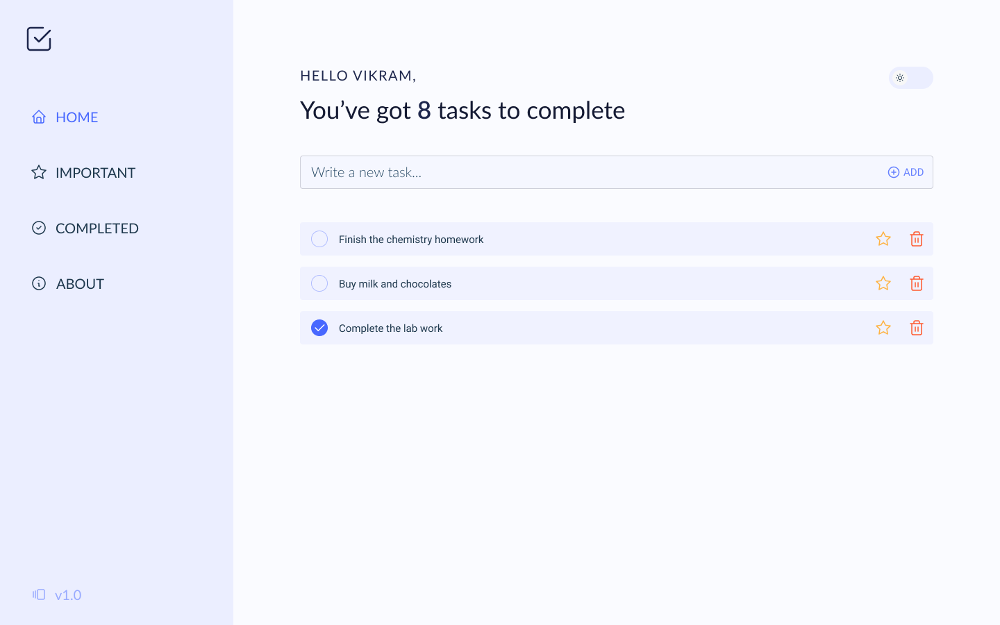
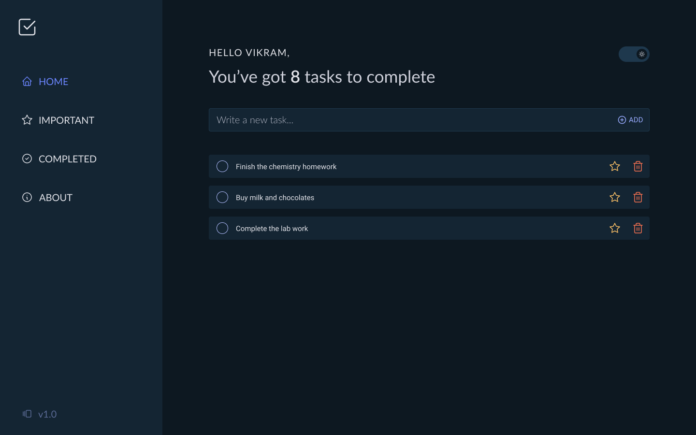

# Tasker

A task management app for those who want to get things done.

Demo - [Tasker](https://tasker-v1.vercel.app "Tasker Preview")

## UI



## Run Locally

Clone the project

```bash
  git clone https://github.com/Vikram-Hegde/Tasker
```

Go to the project directory

```bash
  cd Tasker
```

Install dependencies

```bash
  npm install
```

Start the server

```bash
  npm run dev
```


## Author

- [@VikramCodes](https://twitter.com/VikramCodes)

